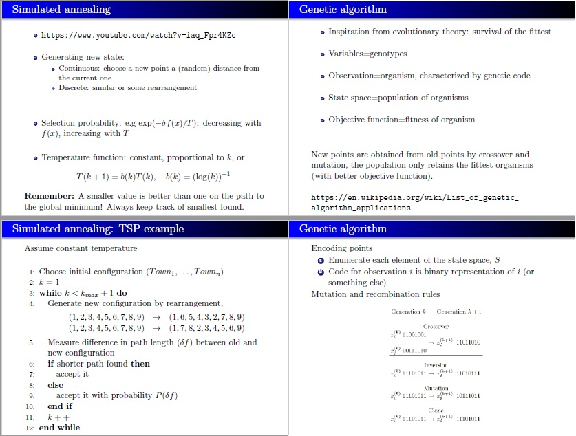

```{r setup, include=FALSE}
knitr::opts_chunk$set(echo = TRUE, fig.align = "center", fig.height = 3.5, out.width = "80%")
```

# Lab 1
## Question 1: Be careful when comparing

```{r}
x1 <- 1/3; x2 <- 1/4
if (x1 - x2 == 1/12) {
  print("Substraction_is_Correct")
}else {
  print("Substraction_is_wrong")
}

x1 <- 1; x2 <- 1/2
if (x1 - x2 == 1/2) {
  print("Substraction_is_Correct")
}else {
  print("Substraction_is_wrong")
}
```

- In the first case x1 = 1/3 is not equal to it's mathematical representation, because when it is represented in decimal fraction it continues to infinity, therefore it have to be rounded to the maximum number of digits allowed. In a 64-bit system, Mantissa equals to 52 bits which when transformed to decimal we only have about 16 signicant digits possible.

```{r}
options(digits = 22)
x1 <- 1/3; x2 <- 1/4
x1
x2
```

- In the second case the result is correct because both numbers equal to their mathematical value, only integers within the allowable range and fractions whose denominators are factors of base 10 i.e. 1/2 and 1/5 can have exact represenation of their mathematical value.

```{r}
x1 <- 1; x2 <- 1/2
x1
x2
```

- To solve this problem we can either use all.equal() function with appropriate tolernave level to test near equality.
```{r}
x1 <- 1/3; x2 <- 1/4
if (isTRUE(all.equal(x1 - x2, 1/12, tolerance = 0.0001))) {
  print("Substraction_is_Correct")
}else {
  print("Substraction_is_wrong")
}
```

- Or we can round both numbers before testing for equality.
```{r}
x1 <- 1/3; x2 <- 1/4
if (round((x1 - x2), 4) == round((1/12),4)) {
  print("Substraction_is_Correct")
}else {
  print("Substraction_is_wrong")
}
```


&nbsp; 

## Question 2: Derivative
```{r}
f <- function(x) {x}
df <- function(x){
  eps <- 10^-15
  (f(x + eps) - f(x)) / eps
}
```

```{r}
df(1)
df(100000)
```

- The true value of both derivatives is equal to 1

- In the first case because of the round-off error, epsilon is not exactly 10^-15 and every time we do arithmatic calculation involving it the result will not resembel the actual number
```{r}
options(digits = 22, scipen = 999)
print(10^-15,digits = 22)
print((1+10^-15),digits = 22)
print((1+10^-15)-1,digits = 22)
```

- In the second case because we are adding two digits, one is large and the other very small, the small value of epsilon is neglected because of underflow, therefore the substraction in the nominator becomes 0 and the derivative will yield 0.\newline 


## Question 3: Variance
```{r}
myvar <- function(x_vec) {
  n <- length(x_vec)
  (1/(1-n)) * (sum(x_vec^2) - (1/n) * sum(x_vec)^2)
}

x_vec <- rnorm(10000, mean = 10^8, sd = 1)

library(ggplot2)
Y1 <- function(x){
  n <- length(x)
  y <- numeric(length = n)
  for(i in 2:n) {
    X    <- x_vec[1:i] 
    y[i] <- myvar(X) - var(X)
  }
  #plot(y, cex = 0.5)
  df <- data.frame(c(1:n),y)
  ggplot(df) +
    geom_point(aes(x = df[,1], y = df[,2]), 
               size = 0.01, 
               color = "#FF3366") +
    labs(title = "Difference between the two Variances", 
         x = "Index",
         y = "Difference")+
    theme_minimal()
}
Y1(x_vec)
```
- myvar() function behave wildly because of what is called Catastrophic Cancelation, where the resulted value of sum(x_vec^2) and (1/n) * sum(x_vec)^2 can not be accurately represented by the machine because of the limited storage, so in this case they are rounded to the same number and canceled each other despite them being actually different.

```{r}
var_YC <- function(v_x){
  ## v_x is a numerical vector of length greater than 2
  ## this function calculates the sample variance 
  ## using the Youngs and Cramer algorithm
  T   <- v_x[1]
  RSS <- 0
  n   <- length(v_x)
  for (j in 2:n){
    T   <- T + v_x[j]
    RSS <- RSS + ((j * v_x[j] - T)^2) / (j*(j-1))
  }
  RSS /(n-1)
}

Y2 <- function(x){
  n <- length(x)
  y <- numeric(length = n)
  for(i in 2:n) {
    X    <- x_vec[1:i] 
    y[i] <- var_YC(X) - var(X)
  }
  
  #plot(y, cex = 0.5)
  df <- data.frame(c(1:n),y)
  options(digits = 3)
  ggplot(df) +
    geom_point(aes(x = df[,1], y = df[,2]), 
               size = 0.01, 
               color = "#FF3366") +
    labs(title = "Difference between the two Variances", 
         x = "Index",
         y = "Difference")+
    theme_minimal()
}
Y2(x_vec)
```
- In the Young-Cramer method, it avoid substracting two numbers of almost the same magnitude, so we get a close approximation to the variance function.


## Question 4: Linear Algebra
```{r error=TRUE}
options(digits = 5)
tecator <- readxl::read_xls("../1. Labs/Data/tecator.xls")

X <- as.matrix(tecator[,-c(1,103)])
y <- as.matrix(tecator[,103])

A <- t(X) %*% X
b <- t(X) %*% y

solve.default(A,b)
```
- The linear system does not have an answer as the matrix A is singular. This Matrix is not invertible. It can happen because of dependency between some variables,i.e, two or more variables are highly correlated. Ths will end in singularity in which the inverse of the matrix does not exist.

```{r}
kappa(A)
```
- The condition number is very high. If a matrix is singular then its condition number is very large.  

For a well-behaved system $Ax = b$, a small change in b ($b+\delta b$) will cause a relatively small change in $x$($x+\delta x$). It means that if $\delta b$ is small we expect that the resulting solution ($\tilde{x}$) should be close to $x$. Such a system is well-conditioned, that is, if $\|\delta b\| / \|b\|$ is small, then $\|\delta x\| /\|x\|$ is likewise small.
By definition:
$$\|\delta x\| / \|x\| \leq \|A\|\|A^{-1}\|\|\delta b\| /\|b\|$$
condition number with respect to inversion is $\|A\|\|A^{-1}\|$. As the condition number tends to infinity the upper bound of relative change in the solution caused by perturbation $\|\delta b\| / \|b\|$  increases. In other words the system is very sensitive to small changes and thus is very susceptible to roundoff error. We do not want this upper bound to be large, so a large condition number is bad.

In this question the condition number is very high and we may conclude that it is an ill-conditioned matrix.


```{r}
X_scaled <- scale(X)
y_scaled <- scale(y)

A_new <- t(X_scaled) %*% X_scaled
b_new <- t(X_scaled) %*% y_scaled


kappa(A_new)
```
- When we scale the data the round-off error becomes less significant, even though the new condition number is lower it is not necessarily well-conditined, but we have lesser perturbation to deal with.


\newpage 
# Lab 2
## Question 1: Optimizing a model parameter

The file mortality rate.csv contains information about mortality rates of the fruit flies during a certain period.

1. Import this file to R and add one more variable LMR to the data which is the natural
logarithm of Rate. Afterwards, divide the data into training and test sets by using the
following code:

n=dim(data )[1] \newline
set.seed(123456) \newline 
id=sample(1:n, floor(n * 0.5)) \newline
train=data[id,] \newline
test=data[-id,] 
```{r}
mortality <- read.csv2("../1. Labs/Data/mortality_rate.csv")
mortality$LMR <- log(mortality$Rate)

n <- dim(mortality)[1]
RNGversion(min(as.character(getRversion()),"3.6.2")) ## with your R-version
set.seed(12345, kind = "Mersenne-Twister", normal.kind = "Inversion")
id <- sample(1:n, floor(n * 0.5))
train <- mortality[id,]
test  <- mortality[-id,]
```

2. Write your own function myMSE() that for given parameters $\lambda$ and list pars containing vectors X, Y, Xtest, Ytest fits a LOESS model with response Y and predictor X using loess() function with penalty $\lambda$ (parameter enp.target in loess()) and then predicts the model for Xtest. The function should compute the predictive MSE, print it and return as a result. The predictive MSE is the mean square error of the prediction on the testing data. It is defined by the following Equation (for you to implement):

$$predictive \ MSE = \frac{1}{length(test)}\sum_{ith \ element \ in \ the \ test \ set}(Ytest[i] - fYpred(X[i]))^2$$
where fYpred(X[i]) is the predicted value of Y if X is X[i]. Read on R's functions for
prediction so that you do not have to implement it yourself.
```{r}
pars  <- list(X = train$Day, 
              Y = train$LMR, 
              Xtest = test$Day, 
              Ytest = test$LMR)

myMSE <- function(lambda, pars){
    model <- loess(pars$Y ~ pars$X, enp.target = lambda)
    Ypred <- predict(model, newdata = pars$Xtest)
    MSE   <- sum((pars$Ytest - Ypred)^2) / dim(test)[1]
    k     <<- k + 1
    return(MSE)
}
```

3. Use a simple approach: use function myMSE(), training and test sets with response LMR
and predictor Day and the following $\lambda$ values to estimate the predictive MSE values: $\lambda$ = 0.1, 0.2,..., 40
```{r }
lambda <- seq(0.1, 40, 0.1)
MSE <- numeric()
k   <- 0
for(i in 1:length(lambda)){
  MSE[i] <- myMSE(lambda[i],pars)
}
```

4. Create a plot of the MSE values versus $\lambda$ and comment on which $\lambda$ value is optimal. How many evaluations of myMSE() were required (read ?optimize) to find this value?
```{r}
plot(MSE, 
     pch = ifelse(MSE == MSE[which.min(MSE)], 4, 1),
     cex = ifelse(MSE == MSE[which.min(MSE)], 1.2, 0.5),
     col = ifelse(MSE == MSE[which.min(MSE)], "red", "blue"))
```

```{r}
df <- data.frame(lambda, MSE)
list("optimal MSE" = df$MSE[which.min(MSE)],
     "optimal lambda value" = df$lambda[which.min(MSE)], 
     "optimal lambda location in the sequence" = which.min(MSE),
     "Number of Iterations" = k)
```

5. Use optimize() function for the same purpose, specify range for search [0.1, 40] and the accuracy 0.01. Have the function managed to find the optimal MSE value? How many
myMSE() function evaluations were required? Compare to step 4.
```{r}
k <- 0  
opt1 <- optimize(myMSE, interval = c(0.1,40), tol = 0.01, pars)
list("optimal MSE" = opt1$objective,
     "optimal lambda location in the sequence" = opt1$minimum,
     "Number of Iterations" = k)
```
\definecolor{myblue}{HTML}{00007D}
- \textcolor{myblue}{In step 4 we had to count all the values of MSE to find the minimum MSE (what is called exhaustive search method) so the total number of iterations is 400, while optimize() function uses a combination of Golden Section Search and Successive Parabolic Interpolation which converge faster (13 iterations) to the minimum MSE (which are multiple values at the minimum).}

6. Use optim() function and BFGS method with starting point $\lambda$ = 35 to find the optimal $\lambda$ value. How many myMSE() function evaluations were required (read ?optim)? Compare the results you obtained with the results from step 5 and make conclusions.
```{r}
k <- 0 
opt2 <- optim(par = 35, fn = myMSE, method = "BFGS", pars = pars)
list("optimal MSE" = opt2$value,
     "Number of  Iterations" = k,
     "Number of function evaluations" = unlist(opt2)[[3]],
     "Number of gradient evaluations" = unlist(opt2)[[4]])
```
- \textcolor{myblue}{Although optim() called myMSE() 3 times, it didn't count the number of finite-difference approximations to the gradient, that's why it shows only 1.}

- \textcolor{myblue}{In comparasion with the previous method (derivative free method), gradient methods are much faster given that the function is differentiable. However, because our variable (lambda) is discrete the BFGS algorithm stuck at nearest point where the derivative is 0, which in this case the derivation at the starting point is 0 so it return the MSE value at that point.}

&nbsp; 

## Question 2: Maximizing likelihood
The file data.RData contains a sample from normal distribution with some parameters $\mu$, $\sigma$. For this question read ?optim in detail.

1. Load the data to R environment.
```{r}
load("../1. Labs/Data/data.RData")
```

2. Write down the log-likelihood function for 100 observations and derive maximum likelihood estimators for $\mu$, $\sigma$ analytically by setting partial derivatives to zero. Use the derived formulae to obtain parameter estimates for the loaded data.


$$\color{myblue} {L(\mu, \sigma^2|X) = \prod_{i=1}^{N} \ \frac{1}{\sigma \sqrt{2\pi}} \ \exp-(\frac{(\mathsf{x_i}-\mu)^2}{2\sigma^2}) = \frac{1}{(\sigma \sqrt{2\pi})^{N}} \ \exp -\bigg(\frac{1}{2\sigma^2}\sum_{i=1}^{N}(\mathsf{x_i}-\mu)^2\bigg)}$$

$$\color{myblue} {l(\mu,\sigma^2|X) = \log\bigg(\frac{1}{(\sigma \sqrt{2\pi})^{N}}\bigg) - \frac{1}{2} \sum_{i=1}^{N}\frac{(\mathsf{x_i}-\mu)^2}{\sigma^2}}$$
\textcolor{myblue}{Taking the derivative with respect to $\mu$ and set it to 0.}
$$\color{myblue} {\frac{\partial{l}}{\partial{\mu}} = 0 \;\;\; \rightarrow \;\;\; - \frac{1}{2\sigma^2} \sum_{i=1}^{N} (2\mu - 2\mathsf{x_i})= 0}$$

$$\color{myblue} {\mu = \frac{1}{N}\sum_{i=1}^{N}\mathsf{x_i}}$$
\textcolor{myblue}{Taking the derivative with respect to sigma and set it to 0.}
$$\color{myblue} {\frac{\partial{l}}{\partial{\sigma}} = 0 \;\;\; \rightarrow \;\;\; - \frac{N}{\sigma} + \sum_{i=1}^{N} (\mathsf{x_i}-\mu)^2 \sigma^{-3}= 0}$$

$$\color{myblue} {\sigma=\sqrt{\frac{1}{N}\sum_{i=1}^{N}(\mathsf{x_i}-\mu)^2}}$$
```{r}
N     <- length(data)
mu    <- (1/N) * sum(data)
sigma <- sqrt((1/N) * sum((data-mu)^2))
paste("Mu =", mu)
paste("Sigma =", sigma)
```

3. Optimize the minus log-likelihood function with initial parameters $\mu$ = 0, $\sigma$ = 1. Try both Conjugate Gradient method (described in the presentation handout) and BFGS (discussed in the lecture) algorithm with gradient specified and without. Why it is a bad idea to maximize likelihood rather than maximizing log-likelihood?

- \textcolor{myblue}{When we have large number of observations, the value of the first part tends to be very small and consequently will be rounded to zero by machine. The same story may happened for the exponential part as the exponent tends to -infinity. So it is bad idea to use this formulation when numerical methods are to use for optimization.}


4. Did the algorithms converge in all cases? What were the optimal values of parameters
and how many function and gradient evaluations were required for algorithms to converge?
Which settings would you recommend?
```{r}
like <- function(pars,data){
  N   <- length(data)
  mu  <- pars[1]
  sd  <- pars[2]
  log <- -(1/(sd * (sqrt(2*pi)))^N) * exp(-((1/2 * sd^2) * sum((data-mu)^2)))
  return(log)
}
print(like(pars = c(mu,sigma), data), digits = 22)

log_like <- function(pars,data){
  N   <- length(data)
  mu  <- pars[1]
  sd  <- pars[2]
  log <- -log(1/(sd * (sqrt(2*pi)))^N) + (1/2) * sum((data-mu)^2/sd^2)
  k   <<- k + 1
  return(log)
}
log_like(pars = c(mu,sigma), data)

gr <- function(pars,data){
  N  <- length(data)
  mu <- pars[1]
  sd <- pars[2]
  mu_gr <- -1 * -(sum(mu-data) / sd^2)
  sd_gr <- -1 * ((-N/sd) + sum((data-mu)^2) / sd^3)
  gr <- c(mu_gr,sd_gr)  
  t  <<- t + 1
  return(gr)
}
t <- 0
gr(pars = c(mu,sigma), data)
```

```{r}
k <- 0
t <- 0
op1 <- optim(par = c(0,1), fn = log_like, method = "CG", data = data)
k1 <- k
t1 <- t

k <- 0
t <- 0
op2 <- optim(par = c(0,1), fn = log_like, method = "BFGS", data = data)
k2 <- k
t2 <- t

k <- 0
t <- 0
op3 <- optim(par = c(0,1), fn = log_like, gr = gr, method = "CG", data = data)
k3 <- k
t3 <- t

k <- 0
t <- 0
op4 <- optim(par = c(0,1), fn = log_like, gr = gr, method = "BFGS", data = data)
k4 <- k
t4 <- t

df    <- data.frame(unlist(op1), unlist(op2), unlist(op3), unlist(op4))
calls <- as.data.frame(matrix(c(k1, k2, k3, k4, t1, t2, t3, t4), 2, byrow = TRUE))
names(calls) <- names(df) 
df    <- rbind(df,calls)

rownames(df) <- c("Mu", "Sigma", "Negative Log-likelihood", "function evaluations", "gradient evaluations", "Convergence", "function calls", "gradient calls")
colnames(df) <- c("CG w/o gradient", "BFGS w/o gradient", "CG with gradient", "BFGS with gradient")

knitr::kable(t(df[1:3,]))
knitr::kable(t(round(df[c(4,5,7,8),],0)))
```

- \textcolor{myblue}{The algorithms converged to the true value of $\mu$ and $\sigma$ in all cases because it is generated from a normal distribution where the log-likelihood function is a continuous differentiable function that has only one global maximum.}

- \textcolor{myblue}{The conjugate-gradient method is a low storage algorithm because it does not involve calculating the hessian matrix, while the BFGS algorithm does not calculate the hessian matrix it approximate it and this make the iterations of BFGS computationally more expensive, compared to the CG and the stored information in approximated hessian make the BFGS use less iterations.}

- \textcolor{myblue}{Deriving and calculating the gradient analytically is better than using finite difference approximations (in the table we can see the function calls=function evaluations when gradient function is used since no finite difference approximations were used).}

- \textcolor{myblue}{Conclusion, both CG and BFGS are good methods, however because we only have 2 variables and small data the BFGS is slightly better since the approximate hessian is small. Therefore; BFGS with gradient is the best option.}


\newpage
# Lab 3
## Question 1: Cluster sampling
An opinion pool is assumed to be performed in several locations of Sweden by sending interviewers
to this location. Of course, it is unreasonable from the financial point of view to visit each city. Instead, a decision was done to use random sampling without replacement with the probabilities proportional to the number of inhabitants of the city to select 20 cities. Explore
the file population.xls. Note that names in bold are counties, not cities.

1. Import necessary information to R.
```{r}
RNGversion(min(as.character(getRversion()), "3.6.2"))
set.seed(12345, kind="Mersenne-Twister", normal.kind="Inversion")

##Question 1: Cluster sampling
population <- read.csv2("../1. Labs/Data/population.csv", stringsAsFactors = FALSE)
```

2. Use a uniform random number generator to create a function that selects 1 city from the
whole list by the probability scheme offered above (do not use standard sampling functions
present in R).

3. . Use the function you have created in step 2 as follows:
(a) Apply it to the list of all cities and select one city
(b) Remove this city from the list
(c) Apply this function again to the updated list of the cities
(d) Remove this city from the list
(e) ... and so on until you get exactly 20 cities.
```{r}
sampler <- function(data, n){
  #taking the cumsum for the probabilities means 
  #we put them in a period from 0 to 1 without overlapping
  data$prob <- cumsum(data[,2] / sum(data[,2]))
  
  cities <- as.character()
  pop    <- as.numeric()
  for(i in 1:n){
    rand <- runif(1)
    #applying the generalized inverse distribution function which takes only the nearest   
    #CMD value that is equal or larger than the probability value ..cities with higher population 
    #cover longer periods so they have higher chances to be closest to the roll
    cities[i] <- data[which.min((data$prob-rand)[which((data$prob-rand)>=0)]),][[1]]
    pop[i]    <- data[which(data[,1] == cities[i]),][[2]]
    data      <- data[-which(data[,2] == pop[i]),]
  }
  res <- data.frame(Municipality = as.character(cities), Population = as.numeric(pop))
  return(res)
}
```

4. Run the program. Which cities were selected? What can you say about the size of the
selected cities?
```{r}
sampler(data = population, n = 20)
```
\definecolor{myblue}{HTML}{00007D}
- \textcolor{myblue}{Most of the selected cities are the ones that have larger population (higher probability)}

5. Plot one histogram showing the size of all cities of the country. Plot another histogram
showing the size of the 20 selected cities. Conclusions?
```{r}
par(mfrow=c(1,2))
hist(population$Population, breaks = 50, xlab = "population", main = "All Cities")
hist(sampler(data = population, n = 20)$Population, breaks = 50, xlab = "population", main = "Sample of 20 Cities")
```
- \textcolor{myblue} {Since we are trying to sample from a discrete distribution we obtain the CDF by cumulatively adding up the individual probabilities for the cities and selecting the nearest city that has it's CMD value equal or larger than the probability generated from the uniform distribution of the CDF, based on the generalized inverse distribution function:}

$$ \color{myblue} {F^{-1}(U) = inf\{x \in {\rm I\!R} : F(x) \geq U\}}$$

&nbsp;

## Question 2: Different distributions
The double exponential (Laplace) distribution is given by formula:
$$DE(\mu, \alpha) = \frac{\alpha}{2} \ \exp(-\alpha|x - \mu|)$$

1. Write a code generating double exponential distribution DE(0,1) from Unif(0,1) by using
the inverse CDF method. Explain how you obtained that code step by step. Generate
10000 random numbers from this distribution, plot the histogram and comment whether
the result looks reasonable.

- \color{myblue} From the PDF of the lablace distribution $DE(\mu, \alpha) = \frac{\alpha}{2} \ \exp(-\alpha|x - \mu|)$ we get the CDF by integrating.

$$\color{myblue} {F(x \geq \mu ) = \int_{-\infty}^{0}\frac{1}{2} \ exp(x) \ dx\ + \int_{0}^{x}\frac{1}{2} \ exp(-x) \ dx}$$ 
$$\color{myblue} {= \frac{1}{2} \ \bigg[exp(x)\bigg]_{-\infty}^0 + \frac{1}{2}\bigg[-exp(-x)\bigg]_0^x}$$
$$\color{myblue} {= 1 - \frac{1}{2}exp(-x)}$$
\newline
$$\color{myblue} {F(x < \mu ) = \int_{-\infty}^{x}\frac{1}{2} \ exp(x) \ dx}$$
$$\color{myblue} {= \frac{1}{2} \ \bigg[exp(x)\bigg]_{-\infty}^x}$$
$$\color{myblue} {= \frac{1}{2}exp(x)}$$
\newline

- \color{myblue} by substituting $F^{-1}F(x)$ in x, where we have $U=F(x)$ we get $F^{-1}(U)$
$$\color{myblue} {U = 1 - \frac{1}{2}exp(-x) \;\;\; \Rightarrow \;\;\; F^{-1}(U) = -ln \ 2(1 - U) \;\;\; ... \;\;\; for \; U\geq \frac{1}{2}}$$
$$\color{myblue} {U = \frac{1}{2}exp(x) \;\;\; \Rightarrow \;\;\; F^{-1}(U) = ln \ 2 U \;\;\; ... \;\;\; for \; U < \frac{1}{2}}$$
\newline 
- \color{myblue} Using the inverse function $F^{-1}(U)$ we can obtain the lablace probability against each uniform probability.
```{r fig.height=3.5}
inverse_cmd <- function(n){
  u <- runif(n)
  
  inverse <- c()
  for(i in 1:n){
    if(u[i] < 0.5){
      inverse[i] <- log(2 * u[i])
    }
    else{
      inverse[i] <- -log(2 * (1 - u[i]))
    }
  }
  return(inverse)
}

x <- inverse_cmd(10000)
hist(x, breaks = 50, main = "Sample of 10000 points from Lablace Distribution")
```
- \color{myblue} The resulted sample has close resemblance to the laplace distribution (double exponential) so it looks reasonable.

2. Use the Acceptance/rejection method with DE(0,1) as a majorizing density to generate
N(0,1) variables. Explain step by step how this was done. How did you choose constant
c in this method? Generate 2000 random numbers N(0,1) using your code and plot the
histogram. Compute the average rejection rate R in the acceptance/rejection procedure.
What is the expected rejection rate ER and how close is it to R? Generate 2000 numbers
from N(0,1) using standard rnorm() procedure, plot the histogram and compare the
obtained two histograms.


\textcolor{myblue} {Target density function:}
$$\color{myblue}{f_Y = \frac{1}{\sqrt{2\pi}}\exp(-x^2/2)}$$

\textcolor{myblue} {Majorizing density function:}
$$\color{myblue}{f_X = \frac{1}{2}\exp(-|x|)}$$

$$\color{myblue}{cf_X \geq f_Y}$$

$$\color{myblue}{c = \frac{2}{\sqrt{2\pi}}\exp(|x|-x^2/2)}$$
\textcolor{myblue} {We set c to 0 to find the value of x}
$$\color{myblue}{\frac{2}{\sqrt{2\pi}}(-x+\frac{x}{|x|})\exp(|x|-x^2/2)=0}$$

\textcolor{myblue} {$\Rightarrow$ for $x\geq 0$  $\Rightarrow$  $x=1$ and for  $x < 0$ $\Rightarrow$ $x=-1$}

$$\color{myblue}{c = \frac{2}{\sqrt{2\pi}}\exp(1-0.5)=\frac{2\sqrt{e}}{\sqrt{2\pi}}}$$
```{r}
c = 2*sqrt(exp(1))/sqrt(2*pi)
cat("The majorizing constant:", c)
```

```{r}
# Target Density Function -- Normal Distribution
fy <- function(x){
  exp(-0.5 * x ^ 2) / sqrt(2 * pi)
}

# Majorizing Density Function -- Laplace Distribution
fx <- function(x){
  exp(-abs(x)) / 2
} 
  
accept_reject <- function(n){
  R <- 0
  Y <- vector(length = n)
  for(i in 1:n){
    repeat {
      y <- inverse_cmd(1)
      U <- runif(1)
      h <- fy(y) / (c * fx(y))
      if(U <= h){
        Y[i] <- y 
        break
        }
      else{R = R+1}
    }
  }
  return(list(Y=Y, Reject=R))
}

set.seed(12345)
Z <- accept_reject(n = 2000)
cat("The number of rejections: ",Z$Reject)

hist(Z$Y, xlab = "Z", main = "Histogram of standard normal distribution", breaks = seq(-4,4,0.1))
```

\textcolor{myblue} {The number of times required to the event "Acceptance" occured is a random variable which has a geometric distribution with success probability of:}

$$\color{myblue}{p = Pr(U\leq \frac{f(Y)}{cg(Y)}|Y=y)}$$


\textcolor{myblue} {Considerind the density distribution $g(Y)$ and the value $\frac{f(y)}{cg(y)}$ we have:}
$$\color{myblue}{p = \int_{-\infty}^{\infty}\frac{f(y)}{cg(y)}g(y)dy=\frac{1}{c}\int_{-\infty}^{\infty}f(y)dy=\frac{1}{c}}$$

```{r}
cat("Expected Rejection Rate: ER = ", 1 - (1/c))
cat("Rejection Rate: R = ", Z$Reject/(Z$Reject+2000))
```
\textcolor{myblue} {The rejection rate "R" is very close to the expected rejection rate "ER"}

```{r}
set.seed(12345)
Z = rnorm(2000)
hist(Z, main = "Histogram of standard normal distribution using R function", breaks = seq(-4,4,0.1))
```
\textcolor{myblue}{The histograms looks fairly similar i.e. generated from normal distribution}


\newpage
# Lab 4
## Question 1: Computations with Metropolis-Hastings
Consider the following probability density function:
$$f(x) \propto x^5 e^{-x}, \;\;\;\; x > 0$$
You can see that the distribution is known up to some constant of proportionality. If you are
interested (NOT part of the Lab) this constant can be found by applying integration by parts
multiple times and equals 120.

1. Use Metropolis-Hastings algorithm to generate samples from this distribution by using
proposal distribution as log-normal $LN(X_t,1)$, take some starting point. Plot the chain
you obtained as a time series plot. What can you guess about the convergence of the chain?
If there is a burn-in period, what can be the size of this period?
```{r}
RNGversion(min(as.character(getRversion()), "3.6.2"))
library(ggplot2)
target <- function(x){
  x^5 * exp(-x)
}

proposed <- function(x, mean){
  dlnorm(x, meanlog = mean, sdlog = 1)
}

MH <- function(x0, n, prop){
  x    <- rep(0,n)
  x[1] <- x0
  for(i in 1:n){
    y     <- rlnorm(1,x[i],1)
    u     <- runif(1)
    alpha <- min(1, (target(y)/target(x[i])) * (prop(x[i], y)/prop(y, x[i])))
    ifelse(u < alpha, x[i+1] <- y, x[i+1] <- x[i])
  }
  return(x)
}
set.seed(12345, kind="Mersenne-Twister", normal.kind="Inversion")
res <- MH(x0 = rlnorm(1), n = 10000, prop = proposed)
```

```{r}
x <- seq(from = 0.1, to = 10, by = 0.1)
ggplot(as.data.frame(x), aes(x = x))+
  geom_line(aes(y = 120 * target(x)))+
  ylim(c(0,3000))+
  ggtitle("Target Distribution")+
  theme_minimal()+
  theme(plot.title = element_text(hjust=0.5))

myplot <- function(data){
  g1 <- ggplot(as.data.frame(data), aes(x = 1:length(data), y = as.numeric(data)))+
    geom_point(size = 0.3)+
    geom_line()+
    ylab("x value")+
    xlab("Data Points")+
    ylim(c(0,10))+
    ggtitle("Sample Chain")+
    theme_minimal()+
    theme(plot.title = element_text(hjust=0.5))
  
  g2 <- ggplot(as.data.frame(data), aes(x = as.numeric(data)))+
          geom_histogram(bins = 50, 
                         alpha = 0.5, 
                         color = "white", 
                         fill = "black",
                         size = 0.4)+
          xlim(c(0,10))+
          ylim(c(0,3000))+
          ylab("Data Points")+
          xlab("x value")+
          ggtitle("Sample Distribution")+
          theme_minimal()+
          theme(plot.title = element_text(hjust=0.5))
  
  list(g1, g2)
}
myplot(res)[[1]]
myplot(res)[[2]]
```
\definecolor{myblue}{HTML}{00007D}
- \textcolor{myblue}{The burn in period depends on the number of iterations/sample points (how much compuation we can afford) and on the starting point which will dictate how many sample points are in a low or high probablity region of the target distribution}

- \color{myblue}In this case since the the starting point is around x = 2 which is at the edge of the high probability region a burn in period of 2-3% is sufficient

2. Perform Step 1 by using the chi-square distribution $\chi^2([X_t + 1])$ as a proposal distribution, where [x] is the floor function, meaning the integer part of x for positive x, i.e.
[2.95] = 2
```{r}
proposed_2 <- function(x, df){
  dchisq(x, floor(df+1))
}

set.seed(12345, kind="Mersenne-Twister", normal.kind="Inversion")
res_2 <- MH(x = rlnorm(1), n = 10000, prop = proposed_2)
myplot(res_2)[[1]]
myplot(res_2)[[2]]
```

3. Compare the results of Steps 1 and 2 and make conclusions.  
- \textcolor{myblue}{The Chi-squared is much better proposed distribution than log-normal because log-normal has it's high probability region near zero while the equilibirium distribution has it's high probability region near 5 that cause a lot of the sampling iterations to fail the condition where we see the chain plot stuck at 5 or close to it for long time because once it gets there it is difficult for the algorithm to find better sample points} 

$$A = min(1, \frac{f(x.proposed)q(x.current | x.proposed)}{f(x.current)q(x.proposed | x.current)})$$
4. Generate 10 MCMC sequences using the generator from Step 2 and starting points 1,2,...,
or 10. Use the Gelman-Rubin method to analyze convergence of these sequences.
```{r}
set.seed(12345, kind="Mersenne-Twister", normal.kind="Inversion")
res_3 <- sapply(1:10, function(x0) MH(x = x0, n = 10000, prop = proposed_2))
library("coda")
mc_list <- mcmc.list()
for(i in 1:10){
  mc_list[[i]] <- as.mcmc(res_3[[i]])
} 
gelman.diag(mc_list)
```
The Gelman_Rubin Covergence diagnostic evaluates the convergence by analyzing the difference between multiple Morkov chains.

Suppose we have estimated $k$ sequences(k chains with different start points) of length $n$.

In this method the within-chain variance for each sequence is estimated, denoted by $S_i$ where i denotes the $i^{th}$ chain, from which the average within variance($W$) is calculated: $W = \frac{1}{k}\sum_{i=1}^{k}{s_i}^2$.  

The between-chains variances are estimated as well, denoted by $B$, which simply is a measure of differences between the different sequences(chains) having different start point.

Then, overall variance is estimated:
$$V = \frac{n-1}{n}W + \frac{1}{n}B$$
Finally the Gelman-Rubin factor is calculated as:
$$\sqrt{R} = \sqrt{\frac{V}{W}}$$

The values much larger than $1$ indicate lack of convergence.

For computing this factor we used the function $gelman.diag()$ from the package $coda$.

5. Estimate
$$\int_0^\infty xf(x)dx$$

### 5.1) Using samples from step 1
Given f(x) as the density function, this integration estimates the expected value of $f(x)$ which is the mean of sample over the generated series which is:
$$\frac{1}{n}\sum_{i=1}^{n}{x.lnorm_i}$$
```{r}
mean(res)
```

### 5.2) Using samples from step 2
Given f(x) as the density function, this integration estimates the expected value of $f(x)$ which is the mean of sample over the generated series which is:
$$\frac{1}{n}\sum_{i=1}^{n}{x.chi_i}$$
```{r}
mean(res_2)
```


6. The distribution generated is in fact a gamma distribution. Look in the literature and
define the actual value of the integral. Compare it with the one you obtained.

The Gamma distribution is as follows:
$$Gamma(\alpha, \beta) = f(x|\alpha,\beta) = [\frac{1}{\Gamma(\alpha)\beta^\alpha}]x^{\alpha-1}exp(-x/\beta)$$

where $\alpha$ and $\beta$ are called "shape factor" and "rate factor" respectively. The expected value of a Gamma distribution is the multiplication of these two factors: $\alpha\beta$.

In our case $\alpha = 6$ and $\beta=1$ which yields the expected value of $6$ for $f(x)$. Our estimation from step 2 is very close to this value which indicates that the chi-square distribution was a good proposal function for sampling from this distribution.

&nbsp; 

## Question 2: Gibbs sampling
A concentration of a certain chemical was measured in a water sample, and the result was stored
in the data chemical.RData having the following variables:
- X: day of the measurement
- Y: measured concentration of the chemical.

The instrument used to measure the concentration had certain accuracy; this is why the measurements can be treated as noisy. Your purpose is to restore the expected concentration values.

1. Import the data to R and plot the dependence of Y on X. What kind of model is reasonable
to use here?
```{r}
chemic = load("C:/Users/WizzCon/Desktop/Machine Learning/1. Workshop/6. Computational Statistics/1. Labs/Data/chemical.RData")
chemic = data.frame(Day = X, Concentration = Y)

ggplot(chemic, aes(Day, Concentration))+geom_point()+theme_bw()
```

As the figure suggests a 2-degree polynomial or a quadratic function  seems to well fit data.


2. A researcher has decided to use the following (random{walk) Bayesian model (n=number
of observations, $\vec{\mu} = (\mu_1,...,\mu_n)$ are unknown parameters):
$$Y_i \; \mathcal{\sim} \; \mathcal{N} (\mu_i, \; variance = 0.2), \;\;\; i = 1,...,n$$
where the prior is
$$p(\mu_1) = 1$$
$$p(\mu_{i+1} \mid \mu_i) = \mathcal{N}(\mu_i, 0.2), \quad i=1,...,n1 $$
Present the formulae showing the likelihood $p(\vec{Y} \mid \vec{\mu})$ and the prior $p(\vec{\mu})$. **Hint**: a chain rule can be used here $p(\vec{\mu}) = p(\mu_1)p(\mu_2\mid\mu_1)p(\mu_3\mid\mu_2)...p(\mu_n\mid\mu_{n1})$

Implementing the random-walk Bayesian model, present the formulae showing the likelihood $p(\Vec{Y}|\Vec{\mu})$ and the prior $p(\Vec{\mu})$.

$$n=number\; of \;observations$$
$$\vec{\mu}=(\mu_1,\;\mu_2,...,\;\mu_n):\; unkonown\; parametesr$$

$$Y_i=N(\mu_i,\;variance=0.2),\;\;\;i=1,...,n$$

Where the prior is:
$$p(\mu_1)=1$$
$$p(\mu_{i+1}|\mu_i)=N(\mu_i,\;0.2),\;\;\;i=1,...,n-1$$

The likelihood for $p(\vec{Y}|\vec{\mu})$ may be derived as:
$$L = \prod_{i=1}^{n}p(Y_i|\mu_i)=\prod_{i=1}^{n}\frac{1}{\sigma\sqrt{2\pi}}\exp(-\frac{(Y_i-\mu_i)^2}{2\sigma^2})$$
$$=(\frac{1}{\sigma\sqrt{2\pi}})^n\exp(-\frac{1}{2\sigma^2}\sum_{i=1}^{n}{(Y_i-\mu_i)^2}),\;\;\;\;\;\;\;\;\;\;(1)$$


The prior function $p(\vec{\mu})$ may be derived as:
$$p(\vec{\mu}) = p(\mu_1)p(\mu_2|\mu_1)p(\mu_3|\mu_2)...p(\mu_n|\mu_{n-1})$$
Given $p(\mu_1) = 1$, we can conclude that:

$$p(\vec{\mu})=\prod_{i=1}^{n-1}{p(\mu_{i+1}|\mu_{i}})$$

We know that $p(\mu_{i+1}|\mu_i)=N(\mu_i,\;0.2),\;\;\;i=1,...,n-1$, so:

$$p(\vec{\mu}) = \prod_{i=1}^{n-1}{p(\mu_{i+1}|\mu_{i}})=\prod_{i=1}^{n-1}{\frac{1}{\sigma\sqrt{2\pi}}\exp(-\frac{(\mu_{i+1}-\mu_i)^2}{2\sigma^2})}$$
$$=(\frac{1}{\sigma\sqrt{2\pi}})^{n-1}\exp(-\frac{1}{2\sigma^2}\sum_{i=1}^{n-1}{(\mu_{i+1}-\mu_i)^2}),\;\;\;\;\;\;\;\;\;\;(2)$$


(1) is the likelihood function for $p(\vec{Y}|\vec{\mu})$, and (2) is the prior function.

3. Use Bayes' Theorem to get the posterior up to a constant proportionality, and then find out the distributions of $(\mu_i \mid \vec{\mu}_{-i}, \vec{Y})$, where $\vec{\mu}_{-i}$ i is a vector containing all $\mu$ values except of $\mu_i$

- Hint A: 

Consider for separate formulae for $(\mu_1 \mid \vec{\mu}_{-1}, \vec{Y}), (\mu_n \mid \vec{\mu}_{-n}, \vec{Y})$ and then a formula for all remaining $(\mu_i \mid \vec{\mu}_{-i}, \vec{Y})$).

- Hint B: 

$$\exp\left(- \frac{1}{d} \left( \left(x-a\right)^2 + \left(x-b\right)^2 \right) \right) \propto \exp \left( - \frac{(x - (a+b)/2)^2}{d / 2} \right)$$

- Hint C: 

$$\exp \left( - \frac{1}{d} \left( (x-a)^2 + (x-b)^2 + (x-c)^2 \right) \right) \propto \exp \left(- \frac{(x - (a+b+c)/3)^2}{d/3} \right)$$


The Baye's theorem:
$$p(\theta|Y)\propto p(Y|\theta)p(\theta)=Likelihood\;*prior$$
where $\theta$ is the parameter of interest.

The parameter of interest in this problem is $\vec{\mu}$. So we are interested to derive a conditional distribution (posterior) of $p(\vec{\mu}|Y)$. The likelihood and the prior we derived in previous step may be used to find the proportionality for the posterior;$posterior\propto\;(1)\;*\;(2)$:


$$p(\vec{\mu}|Y)\propto \exp(-\frac{1}{2\sigma^2}\sum_{i=1}^{n}{(Y_i-\mu_i)^2})\;.\;\exp(-\frac{1}{2\sigma^2}\sum_{i=1}^{n-1}{(\mu_{i+1}-\mu_i)^2})$$

$$\propto\exp(-\frac{1}{2\sigma^2}[(\mu_1-Y_1)^2+\sum_{i=2}^{n}{(\mu_i-Y_i)^2}+(\mu_{i}-\mu_{i-1})^2)],\;\;\;\;\;\;\;\;\;\;(3)$$

(3) is the general form of proportionality for the posterior. To drive the conditional distribution for each $\mu$, we first find $p(\mu_1|\mu_{-1,Y})$ considering that the proportionality principle allows us to remove the terms which do not involve any functional dependence of $\mu$ which means that we are allowed to exclude the terms which do not contain $\mu$:

$$p(\mu_1|\mu_{-1},\vec{Y})\propto\exp(-\frac{1}{2\sigma^2}[(\mu_1-Y_1)^2+(\mu_1-\mu_2)^2])$$
Using Hint $B$ the right hand sid is proportional to:
$$\exp(-\frac{1}{\sigma^2}(\mu_1-\frac{Y_1+\mu_2}{2})^2)$$
Hence,
$$p(\mu_1|\mu_{-1},\vec{Y})\propto\exp(-\frac{1}{\sigma^2}(\mu_1-\frac{Y_1+\mu_2}{2})^2)\;\sim\;N(\frac{Y_1+\mu_2}{2},\;\frac{\sigma^2}{2}),\;\;\;\;\;\;\;(4)$$

Next we derive the distribution $p(\mu_n|{\vec{\mu}}_{-n},\vec{Y})$:

Again according to proportionality principle and the hint $B$ we have:
$$p(\mu_n|{\vec{\mu}}_{-n},\vec{Y})\propto\exp(-\frac{1}{2\sigma^2}[(\mu_{n}-Y_{n})^2+(\mu_{n}-\mu_{n-1})^2)]$$

$$p(\mu_n|{\vec{\mu}}_{-n},\vec{Y})\propto\exp(-\frac{1}{\sigma^2}(\mu_{n}-\frac{Y_{n}+\mu_{n-1}}{2})^2)\;\sim\;N(\frac{Y_{n}+\mu_{n-1}}{2},\;\frac{\sigma^2}{2}),\;\;\;\;\;\;\;(5)$$


And finally we find the conditional distribution $p(\mu_i|{\vec\mu}_{-i},\vec{Y})$ for $i=2,..., n-1$.

For the $i^{th}$ $\mu$ there are three terms in the posterior proportionality derived as (3) which contain $\mu_i$ as there are $mu_{i-1}$ and $\mu_{i+1}$ terms befor and after that. Hence we have:

$$p(\mu_i|{\vec\mu}_{-i},\vec{Y})\propto\exp(-\frac{1}{2\sigma^2}[(Y_i-\mu_{i})^2+(\mu_{i}-\mu_{i-1})^2+(\mu_{i+1}-\mu_i)^2])$$


Using hint $C$ we conclude that

$$p(\mu_i|{\vec\mu}_{-i},\vec{Y})\propto\exp(-\frac{3}{2\sigma^2}(\mu_{i}-\frac{Y_{i}+\mu_{i-1}+\mu_{i+1}}{3})^2)\;\sim\;N(\frac{Y_{i}+\mu_{i-1}+\mu_{i+1}}{3},\;\frac{\sigma^2}{3}),\;\;\;\;\;\;\;(6)$$
4. Use the distributions derived in Step 3 to implement a Gibbs sampler that uses $\vec{\mu}^0 = (0,...,0)$ as a starting point. Run the Gibbs sampler to obtain 1000 values of $\vec{\mu}$ and then compute the expected value of $\vec{\mu}$ by using a Monte Carlo approach. Plot the expected value of $\vec{\mu}$ versus $X$ and $Y$ versus $X$ in the same graph. Does it seem that you have managed to remove the noise? Does it seem that the expected value of $\vec{\mu}$ can catch the true underlying dependence between $Y$ and $X$?

We are asked to obtain 1000 vectors, $\vec{\mu}$, each of which contains $(\mu_1, \mu_2, ..., \mu_n)$, then compute the expected value of each vector and plot the resulted mean vector as the expected values of concentration.

We construct a $1000 * 50$ zero matrix as the initial point. The we update each row implementing the equations $(4), (5), and (6)$ depending on the which column(which elemnt of the vectoe $\mu$) we are updating:

```{r}
y = chemic$Concentration
n= nrow(chemic)

M = 1000
Var = 0.2

mu = matrix(0, nrow = M, ncol = n)
set.seed(12345)
for (i in 1:M) {
  
  for (j in 1:n) {
    if(j ==1){
      mu[i,j] = rnorm(1, mean = (y[1]+mu[i,2])/2, sd = sqrt(Var/2))
      }else if(j == n){
        mu[i,j] = rnorm(1, mean = (y[n] + mu[i,n-1])/2, sd = sqrt(Var/2))
        }else{
          mu[i,j] = rnorm(1, mean = (y[j] + mu[i,j-1] + mu[i,j+1])/2,
                        sd = sqrt(Var/3))
        }
  }
}


```

Having computed all 1000 $\vec{\mu}$, we now compute the expected value of each vector and plot the resulted mean vector vs. day.

```{r}
Mu.mean = apply(mu, 2, mean)
chemic$Mu = Mu.mean

chemic$Type1 = "Observations"
chemic$Type2 = "Gibbs"


ggplot(chemic)+ geom_point(mapping = aes(Day, Concentration, color=Type1))+
  geom_line(mapping = aes(Day, Mu, color = Type2)) + theme(legend.position = "bottom")
```

As the graph shows that the sampler seems to capture the relationship between Day and Concentration. Obviously it could remove the noise.


5. Make a trace plot for $\mu_n$ and comment on the burn-in period and convergence.

```{r}
plot(mu[,50], type = 'l', main = "Trace plot of mu_50")
```

The trace plot of $\mu_{50}$ can be seen in the figure above. It seems that it fluctuates around a mean value about 1.5. Ignoring some high jumps within the data, we may say that it converged. The trace plot seems that converged as it started and no obvious burn in part may be distinguished precisely.


\newpage
# Lab 5
## Question 1: Hypothesis testing
In 1970, the US Congress instituted a random selection process for the military draft. All 366
possible birth dates were placed in plastic capsules in a rotating drum and were selected one
by one. The first date drawn from the drum received draft number one, the second date drawn
received draft number two, etc. Then, eligible men were drafted in the order given by the draft
number of their birth date. In a truly random lottery there should be no relationship between
the date and the draft number. Your task is to investigate whether or not the draft numbers were
randomly selected. The draft numbers (Y=Draft_No) sorted by day of year (X=Day_of_year) are
given in the file lottery.xls.

1. Make a scatterplot of Y versus X and conclude whether the lottery looks random.
```{r}
RNGversion(min(as.character(getRversion()), "3.6.2"))

library("readxl")
lottery <- read_xls("../1. Labs/Data/lottery.xls")
Y <- lottery$Draft_No
X <- lottery$Day_of_year
plot(X,Y, pch = 19, cex = 0.5)
```
\definecolor{myblue}{HTML}{00007D}
- \textcolor{myblue}{From the plot it is not possible to tell whether the lottery is random or not.}

2. Compute an estimate $\hat{Y}$ of the expected response as a function of X by using a loess
smoother (use loess()), put the curve $\hat{Y}$ versus X in the previous graph and state again
whether the lottery looks random.
```{r}
plot(X,Y, pch = 19, cex = 0.5)
Y_hat <- loess(Y ~ X)$fitted
points(X, Y_hat, col = "blue", pch = 19, cex = 0.5)
```
- \textcolor{myblue}{From the loess smoother it sounds like the men with birth dates at the end of the year are less likely to get drafted to military.}

3. To check whether the lottery is random, it is reasonable to use test statistics
$$T = \frac {\hat{Y}(X_b) - \hat{Y}(X_a)}{X_b - X_a}, \;\;\; where \; X_b = argmax_X Y(X), \; X_a = argmin_X Y(X)$$
If this value is significantly greater than zero, then there should be a trend in the data
and the lottery is not random. Estimate the distribution of T by using a non-parametric
bootstrap with B = 2000 and comment whether the lottery is random or not. What is the
p-value of the test?
```{r}
T <- function(X,Y){
  Xb <- X[which.max(Y)]
  Xa <- X[which.min(Y)]
  Y_Xb <- max(Y)
  Y_Xa <- min(Y)

  t <- (Y_Xb - Y_Xa) / (Xb - Xa)
  return(t)
}


B <- 2000
n <- dim(lottery)[1]
tsamp <- rep(NA,B)
set.seed(12345, kind="Mersenne-Twister", normal.kind="Inversion")
for (i in 1:B){
  mysample <- lottery[sample(n, size = n, replace = TRUE),]
  X        <- mysample$Day_of_year
  Y        <- loess(mysample$Draft_No ~ mysample$Day_of_year)$fitted
  tsamp[i] <- T(X, Y)
}
hist(tsamp,breaks=100)

pvalue <- sum(tsamp > 0) / B
pvalue
```
- \textcolor{myblue}{With the low p-value we are more likely to reject the null-hypothesis that the lottery is random.}

4. Implement a function depending on data and B that tests the hypothesis
\newline
$H_0$: Lottery is random
\newline
versus
\newline
$H_1$: Lottery is non-random
\newline
by using a permutation test with statistics T. The function is to return the p-value of this
test. Test this function on our data with B = 2000.
```{r}
test_hypothesis <- function(data, B){
  n  <- dim(data)[1]
  tx <- numeric(B)
  set.seed(12345, kind="Mersenne-Twister", normal.kind="Inversion")
  for (i in 1:B){
    X     <- sample(n, size = n, replace = TRUE)
    Y     <- loess(data$Draft_No ~ X)$fitted
    tx[i] <- T(X, Y) 
  }
  return(tx)
}
tx <- test_hypothesis(data = lottery, B = 2000)
hist(tx,breaks=100)

Y0 <- loess(lottery$Draft_No ~ lottery$Day_of_year)$fitted
t0 <- T(lottery$Day_of_year, Y0)
pvalue <- length(which(abs(tx) >= abs(t0))) / B
pvalue
```

5. Make a crude estimate of the power of the test constructed in Step 4:
(a) Generate (an obviously non-random) dataset with n = 366 observations by using same
X as in the original data set and Y (x) = max(0, min($\alpha$x + $\beta$, 366)), where $\alpha$ = 0,1
and $\beta \;  \mathcal \sim N(183, sd = 10)$.
(b) Plug these data into the permutation test with B = 200 and note whether it was
rejected.
(c) Repeat Steps 5a-5b for $\alpha$ = 0.2,0.3,...,10. 

What can you say about the quality of your test statistics considering the value of the
power?
```{r}
alpha   <- seq(0.1, 10, 0.1)
pvalues <- vector(length = length(alpha))
for(j in 1:length(alpha)){
  X <- lottery$Day_of_year
  Y <- numeric(366)
  for(i in 1:366){
    beta <- rnorm(1, mean=183, sd=10)
    YY   <- min((alpha[j] * X[i] + beta), 366)
    Y[i] <- max(0, YY)
  }
  newdata <- data.frame("Day_of_year" = X, "Draft_No" = Y)
  tvec    <- test_hypothesis(data = newdata, B = 200)
  Y0      <- loess(Draft_No ~ Day_of_year, data = newdata)$fitted
  t0      <- T(newdata$Day_of_year, Y0)
  pvalues[j] <- mean(abs(tvec) > abs(t0))
}
length(which(pvalues < 0.05)) / 100
```
- \textcolor{myblue}{The value of the power is 1 meaning all our rejections for the null-hypothesis are correct (no type II error: failure to reject the false null-hypothesis) which solidify the opinion that the lottery is not random.}

\newpage 

## Question 2: Bootstrap, jackknife and condfidence intervals
The data you are going to continue analyzing is the database of home prices in Albuquerque,
1993. The variables present are Price; SqFt: the area of a house; FEATS: number of features
such as dishwasher, refrigerator and so on; Taxes: annual taxes paid for the house. Explore the
file prices1.xls.

1. Plot the histogram of Price. Does it remind any conventional distribution? Compute the
mean price.
```{r}
prices <- read_xls("../1. Labs/Data/prices1.xls")
hist(prices$Price, breaks = 50)

mean(prices$Price)
```

2. Estimate the distribution of the mean price of the house using bootstrap. Determine the
bootstrap bias-correction and the variance of the mean price. Compute a 95% confidence
interval for the mean price using bootstrap percentile, bootstrap BCa, and first-order
normal approximation \newline
(**Hint**: use boot(),boot.ci(),plot.boot(),print.bootci())
```{r warning=FALSE}
library(boot)
mymean <- function(data, ind){
  mean(data[ind])
}
set.seed(12345, kind="Mersenne-Twister", normal.kind="Inversion")
samples <- boot(data = prices$Price, statistic = mymean, R = 2000)

plot(samples)

mean(samples$t)
bias_correction <- 2 * mean(prices$Price) - mean(samples$t)
bias_correction


var(samples$t)[[1]]

conf_ints <- boot.ci(samples)
conf_ints
```

```{r echo=FALSE}
hist(samples$t, main="Distribution of the mean price and confidence intervals", xlab="Mean Price", breaks = 50)
abline(v = conf_ints$normal[2:3], 
       col = "black", 
       lty = "dashed", 
       lwd = 1.5)
abline(v = mean(conf_ints$normal[2:3]), 
       col = "black", 
       lwd = 1.5)
abline(v = conf_ints$percent[4:5], 
       col = "blue", 
       lty = "dashed", 
       lwd = 1.5)
abline(v = mean(conf_ints$percent[4:5]), 
       col = "blue", 
       lwd = 1.5)
abline(v = conf_ints$bca[4:5], 
       col = "red", 
       lty = "dashed", 
       lwd = 1.5)
abline(v = mean(conf_ints$bca[4:5]), 
       col = "red", 
       lwd = 1.5)
legend(x      = "topright", 
       legend = c("Normal", "Percent", "Bca"), 
       fill   = c("black", "blue", "red"))
```

3. Estimate the variance of the mean price using the jackknife and compare it with the
bootstrap estimate
```{r}
Ti <- rep(NA, length(prices$Price))
n  <- length(prices$Price)
for(i in 1:n){
  jack  <- prices$Price[-i] 
  Ti[i] <- n * mean(prices$Price) - (n-1) * mean(jack)
}
J_mean <- mean(Ti)
J_mean
J_Var  <- sum((Ti-J_mean)^2) / (n*(n-1))
J_Var
```


4. Compare the confidence intervals obtained with respect to their length and the location of
the estimated mean in these intervals.


\newpage
# Lab 6
## Question 1: Genetic algorithm
In this assignment, you will try to perform one-dimensional maximization with the help of a
genetic algorithm.

1. Define the function
$$f(x) = \frac{x^2}{e^x} - 2 \; exp(-(9 \; sin \; x) / (x^2+x+1))$$
```{r}
RNGversion(min(as.character(getRversion()), "3.6.2"))

f <- function(x){
  (x^2/exp(x)) - 2 * exp(-(9 * sin(x)/(x^2+x+1)))
}
```

2. Define the function crossover(): for two scalars x and y it returns their "kid" as (x+y)=2.
```{r}
crossover <- function(x,y){
  (x+y)/2
}
```

3. Define the function mutate() that for a scalar x returns the result of the integer division
x2 mod 30. (Operation mod is denoted in R as %%).
```{r}
mutate <- function(x){
  x^2 %% 30
}
```

4. Write a function that depends on the parameters maxiter and mutprob and: 

(a) Plots function f in the range from 0 to 30. Do you see any maximum value? 
(b) Defines an initial population for the genetic algorithm as X = (0,5,10,15,...,30).
(c) Computes vector Values that contains the function values for each population point.
(d) Performs maxiter iterations where at each iteration 

> i. Two indexes are randomly sampled from the current population, they are further
used as parents (use sample()).
>ii. One index with the smallest objective function is selected from the current population,
the point is referred to as victim (use order()).
>iii. Parents are used to produce a new kid by crossover. Mutate this kid with probability
mutprob (use crossover(), mutate()).
>iv. The victim is replaced by the kid in the population and the vector Values is
updated.
>v. The current maximal value of the objective function is saved.

(e) Add the final observations to the current plot in another colour.

```{r fig.align='center', out.height="30%"}
X <- seq(from = 0, to = 30, by = 0.01)
plot(X, f(X), type = "l", main = "Objective function")
```

```{r fig.height=10, fig.width=10, fig.align='center'}
genetic <- function(maxiter, mutprob){
  sinusoid  <- seq(from = 0, to = 30, by = 0.01)
  X         <- seq(from = 0, to = 30, by = 5)
  plot(sinusoid, f(sinusoid), type = "l",
       main = paste("maxiter = ", maxiter, ", mutprob = ", mutprob),
       xlab = "X",
       ylab = "f(X)")
  points(X, f(X), col = "red", pch = 16, cex = 2)
  
  Values  <- f(X)
  max_val <- -Inf
  for(i in 1:maxiter){
    parents <- sample(X, size = 2)
    victim  <- order(Values)[1]
    kid <- crossover(x = parents[1], y = parents[2])
    kid <- ifelse(mutprob > runif(1), mutate(kid), kid)
    X[victim] <- kid
    Values    <- f(X)
    max_val   <- max(max_val, max(Values))
  }
  list(optimum = max_val, population = X, Values = Values)

  points(X, Values, pch = 21, col = "blue", cex = 2, lwd = 1.5)
  legend(x = "topright", legend = c("Initial", "final"), pch = c(16,21),
         col = c("red", "blue"), cex = c(1.5, 1.5))
}

maxiter = c(10, 100)
mutprob = c(0.1, 0.5, 0.9)
par(mfrow = c(3,2))
for(prob in mutprob){
  for(iter in maxiter){
    set.seed(12345)
    genetic(iter, prob)
  }
}
```
\definecolor{myblue}{HTML}{00007D}
- \textcolor{myblue}{The initial population is well diversed over the inspected interval and that will "ensure that the solution space is adequately searched, especially in the earlier stages of the optimization process"}[@Gupta]

- \textcolor{myblue}{In this case fewer iterations are not enough to converge to global maximum and since more iteration is need to fully search the solution space}

- \textcolor{myblue}{The crossover is applied to all the population to generate new offsprings by taking the mean of the parents, in part this will increase the diversity since the kids will be at the most distance from the parents. \newline And on the other part the mean function could produce new generation identical to the old one when the middle value is another old generation and given the low starting population this will have great effect unless we provide a condition to deselect any old generation result from the crossover}

- \textcolor{myblue}{The mutation provide exploration and prevent the algorithm from converging to local maximum, small mutation rate GA could cause premature convergence and could stuck anywhere in the fitness function, however because the fitness function is not so complex GA converged easily to global maximum with mutation rate = 0.1.}

- \textcolor{myblue}{In the mean while higher mutation rates provide more exploration and that could cause GA to not settle long time in the global maximum because there is high probability we are replacing high fit parents with new generation that is not necessarily better fit}


\newpage 

## Question 2: EM algorithm
The data file physical.csv describes a behavior of two related physical processes Y = Y (X)
and Z = Z(X).

1. Make a time series plot describing dependence of Z and Y versus X. Does it seem that two
processes are related to each other? What can you say about the variation of the response
values with respect to X?
```{r fig.align='center', fig.height=3.5, fig.width=12}
physical <- read.csv("../1. Labs/Data/physical1.csv")
library(ggplot2)
ggplot(physical, aes(x = X)) +
  geom_line(aes(y = Y, col = "Y"), size = .3) +
  geom_line(aes(y = Z, col = "Z"), size = .3) +
  scale_color_manual(values = c("#FF3366", "#00CCFF"), name = "Variable: ") +
  labs(y = "Value", x = "Time") +
  theme_bw()
```
- \textcolor{myblue}{Variance of Y and Z is decreasing while X increases}


2. Note that there are some missing values of Z in the data which implies problems in estimating
models by maximum likelihood. Use the following model
$$Y_i \mathcal \; \sim \; exp(X_i/\lambda), \; \; \; \; Z_i \mathcal \; \sim \; exp(X_i/2\lambda)$$
where $\lambda$ is some unknown parameter. \newline 
**The goal is to derive an EM algorithm that estimates $\lambda$.**

\definecolor{mybrown}{HTML}{5D2441}
$$\color{mybrown}{p(Y_i|\lambda) = \frac{X_i}{\lambda} \; \exp(-\frac{X_iY_i}{\lambda}), \;\;\;\; p(Z_i|\lambda) = \frac{X_i}{2\lambda} \; \exp (-\frac{X_iZ_i}{2\lambda})}$$
\newline
\setlength{\leftskip}{5mm}
\textcolor{myblue}{Since there is little correlation between Y and Z we can assume they are independent so we can get joint distribution by only multiplying them together and derive the likelihood accordingly}

$$\color{mybrown}{L(\lambda|Y_i,Z_i) = \prod_{i=1}^n p(Y_i|\lambda) . p(Z_i|\lambda) = \prod_{i=1}^n \bigg(\frac{X_i}{\lambda} \; \exp(-\frac{X_iY_i}{\lambda}) \bigg)  \bigg( \frac{X_i}{2\lambda} \; \exp (-\frac{X_iZ_i}{2\lambda}) \bigg)}$$


$$\color{mybrown}{= \frac{\prod_{i=1}^n X_i^2}{(2 \lambda^2)^n}  \; \exp\bigg(-\frac{1}{\lambda} \sum_{i=1}^{n} X_i Y_i - \frac{1}{2\lambda} \sum_{i=1}^{n} X_i Z_i \bigg)}$$
\setlength{\leftskip}{5mm}
\textcolor{myblue}{By taking the log-liklihood we get:}

$$\color{mybrown}{l(\lambda|Y_i,Z_i) = 2\ln\Big(\prod_{i=1}^n X_i\Big)-\Big(n\ln(2)+2n\ln(\lambda) \Big) -\frac{1}{\lambda}\sum_{i=1}^{n} X_i Y_i - \frac{1}{2\lambda} \sum_{i=1}^{n} X_i Z_i}$$

\setlength{\leftskip}{5mm}
\textcolor{myblue}{Because Z has missing values we need to seperate the last term into two parts}

$$\color{mybrown}{l(\lambda|Y_i,Z_i) = 2\ln\Big(\prod_{i=1}^n X_i\Big)-\Big(n\ln(2)+2n\ln(\lambda) \Big) - \frac{1}{\lambda} \sum_{i=1}^{n} X_i Y_i - \frac{1}{2\lambda} \sum_{i\in Observed} X_i Z_i - \frac{1}{2\lambda} \sum_{j\in Missing} X_j Z_j}$$
\newline 

\setlength{\leftskip}{5mm}
\textcolor{myblue}{We can estimate the missing values by mutating them with the estimated value of $\lambda$ given Y and Z} 

$$\color{mybrown}{E[l(\lambda|Y_i,Z_i)] = E\Bigg[ 2\ln\Big(\prod_{i=1}^n X_i\Big)-\Big(n\ln(2)+2n\ln(\lambda) \Big) - \frac{1}{\lambda} \sum_{i=1}^{n} X_i Y_i -\frac{1}{2\lambda} \sum_{i\in Observed} X_i Z_i - \frac{1}{2\lambda} \sum_{j\in Missing} X_j Z_j \Bigg]}$$
\newline 

\setlength{\leftskip}{5mm}
\textcolor{myblue}{For the exponential distribution the expected value of Z would be}
$$\color{mybrown}{E[Z_j] = \frac{2\lambda_t}{X_j}, \;\;\;where \; \lambda_t \; is \; the \; lambda \; from \; last \; iteration}$$
$$\color{mybrown}{E \bigg[\frac{1}{2\lambda} \sum_{j\in Missing} X_j Z_j \bigg] = M \frac{\lambda_t}{\lambda}, \;\;\; where \; M  \; is  \; the  \; number  \; of  \; missing  \; values}$$
\newline 

\setlength{\leftskip}{5mm}
\textcolor{myblue}{Now we have a log-likelihood function that can be maximized}
$$\color{mybrown}{E[l(\lambda|Y_i,Z_i)] = 2\ln\Big(\prod_{i=1}^n X_i\Big)-\Big(n\ln(2)+2n\ln(\lambda) \Big) - \frac{1}{\lambda} \sum_{i=1}^{n} X_i Y_i - \frac{1}{2\lambda} \sum_{i\in K} X_i Z_i -  M \frac{\lambda_t}{\lambda}}$$
\newline 

\setlength{\leftskip}{5mm}
\textcolor{myblue}{In the M step we take the partial derivative with respect to $\lambda$:}

$$\color{mybrown}{\frac{\partial E[l(\lambda|Y_i,Z_i)]}{\partial \lambda} = -\frac{2n}{\lambda} + \frac{1}{\lambda^2} \sum_{i=1}^{n} X_i Y_i + \frac{1}{2\lambda^2}\sum_{i\in Observed} X_i Z_i + M\frac{\lambda_t}{ \lambda^2} = 0}$$ 

$$\color{mybrown}{\lambda_{t+1} = \frac{1}{2n} \bigg(\sum_{i=1}^{n} X_i Y_i+\frac{1}{2}\sum_{i\in Observed} X_i Z_i + M\lambda_t \bigg)}$$ 

\setlength{\leftskip}{5mm}
\textcolor{myblue}{Where $\lambda_{t+1}$ is the next $\lambda$}


3. Implement this algorithm in R, use $\lambda_0$ = 100 and convergence criterion "stop if the change in $\lambda$ is less than 0.001". What is the optimal $\lambda$ and how many iterations were required to compute it?
```{r}
n   <- dim(physical)[1]
obs <- which(!is.na(physical$Z))
mis <- which(is.na(physical$Z))
M   <- length(mis)

dif    <- Inf
lambda <- 100
t      <- 0
repeat{
  lambda_new <- (sum(physical$X * physical$Y) + 
                 M * lambda + 
                 0.5 * sum(physical$X[obs] * physical$Z[obs])) / (2*n)
  
  dif    <- abs(lambda_new - lambda)
  lambda <- lambda_new
  t      <- t + 1
  
  print(lambda)
  if(dif < 0.001)break
}
cat("\nOptimal Lambda:", lambda)
cat("\nNumber of iterations:", t)
```

4. Plot E [Y ] and E[Z] versus X in the same plot as Y and Z versus X. Comment whether
the computed $\lambda$ seems to be reasonable.
```{r fig.align='center', fig.height=3.5, fig.width=12}
library(ggplot2)
ggplot(physical, aes(x = X))+ 
  geom_line(mapping = aes(y = Y, color="Y")) +
  geom_line(mapping = aes(y = Z, color="Z")) +
  geom_line(mapping = aes(y = lambda/X, color="E(Y)"), linetype = "dashed", size = .3) +
  geom_line(mapping = aes(y = 2*lambda/X, color="E(Z)"), linetype = "dashed", size = .3) +
  scale_color_manual(values = c("#FF3366", "#00CCFF", "#FF3366", "#00CCFF"), name = "Variable: ") +
  ylab("") +
  theme(legend.position = "bottom") +
  theme_bw()
```

# Lectures 
## Lecture 1


```{r echo=TRUE, eval=FALSE}
# Lecture 1
# Snippet 1
x<-0.5^10000;y<-0.4^10000;print(x/(x+y)+y/(x+y))
x<-0.5^1000;y<-0.4^1000;print(x/(x+y)+y/(x+y)) 
x<-0.1^1000;y<-0.2^1000;print(x/(x+y)+y/(x+y))
readline()
t<-rnorm(5,10^18,1);print(t[3]-t[4]);print(t[1]-t[2])
readline()
x<-10^800;sd<-10^400;y<-x/sd;print(y)


# Snippet 2
## Example due to Thomas Ericsson in his Numerical Analysis course at Chalmers
f1<-function(x){(x-1)^6}
f2<-function(x){1-6*x+15*x^2-20*x^3+15*x^4-6*x^5+x^6}

x<-seq(from=0.995,to=1.005,by=0.0001)
y1<-f1(x);y2<-f2(x)

plot(x,y1,pch=19,cex=0.5,ylim=c(-5*10^(-15),20*10^(-15)),main="Two ways to calculate (x-1)^6",xlab="x",ylab="y")
points(x,y2,pch=18,cex=0.8)
```


## Lecture 2


```{r echo=TRUE, eval=FALSE}
# Lecture 2
# Snippet 1
library(mvtnorm)
vnorm.data<-rmvnorm(10000,mean=c(0,0),sigma=rbind(c(1,0.8),c(0.8,1)))
x <- y <- seq(-8, 8, len = 200)
X <- expand.grid(x = x, y = y)
X <- transform(X, z = dnorm(x, -2.5)*dnorm(y) + 0.5*dnorm(x, 2.5)*dnorm(y))
z <- matrix(X$z, nrow = 200)
pdf("bivarNorm.pdf");persp(x, y, z, col = "lightblue", border = NA,
   theta = 20, phi = 20, ticktype = "detailed", 
   ltheta = -120, shade = 0.25);dev.off()
   

# Snippet 2
## from ?optmize
require(graphics)
     
f <- function (x, a) (x - a)^2
xmin <- optimize(f, c(0, 1), tol = 0.0001, a = 1/3)
print(xmin)
     
## See where the function is evaluated:
optimize(function(x) x^2*(print(x)-1), lower = 0, upper = 10)
     
## "wrong" solution with unlucky interval and piecewise constant f():
f  <- function(x) ifelse(x > -1, ifelse(x < 4, exp(-1/abs(x - 1)), 10), 10)
fp <- function(x) { print(x); f(x) }
     
plot(f, -2,5, ylim = 0:1, col = 2)
xmin1<-optimize(fp, c(-4, 20))   # doesn't see the minimum
print("sssssssssssssssssssssssss")
print(xmin1)
print("=========================")
xmin2<-optimize(fp, c(-7, 20))   # ok
print("sssssssssssssssssssssssss")
print(xmin2)


#Snippet 3
## "wild" function , global minimum at about -15.81515
fw <- function (x)
         10*sin(0.3*x)*sin(1.3*x^2) + 0.00001*x^4 + 0.2*x+80
plot(fw, -50, 50, n = 1000, main = "optim() minimising 'wild function'")
# method = c("Nelder-Mead", "BFGS", "CG", "L-BFGS-B", "SANN","Brent")     
res <- optim(50, fw, method = "SANN",lower = -Inf, upper = Inf, control = list(maxit = 20000, temp = 20, parscale = 20), hessian = FALSE)
# res$par= -15.8144, res$value=67.47249, res$$counts["function"]=20000,res$$counts["gradient"]=NA, res$convergence=0 (did!), res$message=NULL
```

## Lecture 3


```{r echo=TRUE, eval=FALSE}
# Lecture 3
#Snippet 1
fthreebits<-function(k,s,L,N){
    X0<-4*s+1;a<-8*k+5;m<-2^L;X<-X0
    for (i in 1:N){
	print(c(X,rev(intToBits(X)[1:5])))
	X<-(a*X)%%m ##c=0
    }
}

#Snippet 2
fCongGenGrid<-function(a,m,c,X0,N){
    X<-X0;vU<-rep(X0,N)
    for (i in 1:N){vU[i]<-X;X<-(a*X+c)%%m}
    vU<-vU/m;plot(vU[1:(N-1)],vU[2:N],pch=19,cex=0.8,main="",xlab="Xk/m",ylab="X(k+1)/m")
};fCongGenGrid(a=17,m=131,c=8,X0=4,N=200)

#Snippet 3
fsimNorm<-function(N){
    mTD<-matrix(runif(2*N),ncol=N,nrow=2)
    mTD[1,]<-mTD[1,]*2*pi
    apply(mTD,2,function(TD){Th<-TD[1];D<-TD[2];a<-sqrt(-2*log(D));c(a*sin(Th),a*cos(Th))})
}

#Snippet 4
fgenbeta<-function(c){
    x<-NA
    num.reject<-0
    while (is.na(x)){
	y<-runif(1)
	u<-runif(1)
	if (u<=dbeta(y,2,7)/c){x<-y}
	else{num.reject<-num.reject+1}
    }
    c(x,num.reject)
}

y<-dbeta(seq(0,2,0.001),2,7)
c<-max(y)

mbetas1<-sapply(rep(c,10000),fgenbeta)
mbetas2<-sapply(rep(4,10000),fgenbeta)

hist(mbetas1[2,],col="black",breaks=100,xlab="",ylab="",freq=FALSE,main="");hist(mbetas2[2,],col=gray(0.8),breaks=100,xlab="",ylab="",freq=FALSE,main="",add=TRUE);legend("topright",pch=19,cex=1.5,legend=c("c=3.172","c=4"),col=c("black",gray(0.8)),bty="n");
hist(mbetas1[1,],col="black",breaks=100,xlab="",ylab="",freq=FALSE,main="",ylim=c(0,3.5));hist(mbetas2[1,],col=gray(0.8),breaks=100,xlab="",ylab="",freq=FALSE,main="",add=TRUE);points(seq(0,2,0.001),y,pch=19,cex=0.3,col=gray(0.4));abline(h=3.172554,lwd=3);legend("right",pch=19,cex=1.5,legend=c("c=3.172","c=4"),col=c("black",gray(0.8)),bty="n");
```

## Lecture 4


```{r echo=TRUE, eval=FALSE}
# Lecture 4
# Snippet 1
library("shape")
source("732A90_ComputationalStatisticsVT2017_Lecture04codeSlide02a.R")

num.repeats<-1
Nmax<-100000
vN<-seq(from=5,to=Nmax,by=100)

vests<-t(sapply(vN,function(N,num.repeats){replicate(num.repeats,f.circArea(N))},num.repeats=num.repeats,simplify=TRUE))

plot(vN,vests,cex=0.3,pch=19,xlab="N",ylab=expression(pi),ylim=c(pi-0.1,pi+0.1),cex.lab=2,cex.axis=1.5,col="white",main="");abline(h=pi,lwd=2)
points(vN,pi+1.96*sqrt(pi/vN),col="gray",pch=19,cex=0.4)
points(vN,pi-1.96*sqrt(pi/vN),col="gray",pch=19,cex=0.4)
points(vN,vests,col="black",pch=19,cex=0.3)

N<-200
x<-runif(N)
y<-runif(N)
plot(x,y,xlab="x",ylab="y",ylim=c(-1.2,1.2),xlim=c(-1.2,1.2),main="",pch=19,col="black",cex=0.4,asp=1,cex.lab=2,cex.axis=1.5)
apply(cbind(x,y),1,function(xy){if((xy[1]^2+xy[2]^2)>1){points(xy[1],xy[2],cex=0.4,col="gray")}})
plotcircle(mid=c(0,0),r=1)
abline(v=0)
abline(h=0)
rect(-1,-1,1,1)

# Snippet 2
f.circArea<-function(N){
    m.xy<-cbind(runif(N),runif(N))
    4*sum(apply(m.xy,1,function(xy){xy[1]^2+xy[2]^2<1}))/N
}

# Snippet 3
f.OU.MC<-function(nstep,X0){
    vN<-1:nstep
    vX<-rep(X0,nstep);X<-X0
    for (i in 2:nstep){
	X<-exp(-0.1)*X+rnorm(1,0,sqrt(2.5*(1-exp(-0.2))))
	vX[i]<-X
    }
    plot(vN,vX,pch=19,cex=0.3,col="black",xlab="t",ylab="X(t)",main="",ylim=c(min(X0-0.5,-5),max(5,X0+0.5)))
    abline(h=0)
    abline(h=1.96)
    abline(h=-1.96)
}

# Snippet 4
f.MCMC.MH<-function(nstep,X0,props){
    vN<-1:nstep
    vX<-rep(X0,nstep);
    for (i in 2:nstep){
	X<-vX[i-1]
	Y<-rnorm(1,mean=X,sd=props)
	u<-runif(1)
	a<-min(c(1,(dnorm(Y)*dnorm(X,mean=Y,sd=props))/(dnorm(X)*dnorm(Y,mean=X,sd=props))))
	if (u <=a){vX[i]<-Y}else{vX[i]<-X}    
    }
    plot(vN,vX,pch=19,cex=0.3,col="black",xlab="t",ylab="X(t)",main="",ylim=c(min(X0-0.5,-5),max(5,X0+0.5)))
    abline(h=0)
    abline(h=1.96)
    abline(h=-1.96)
}

# Snippet 5
f.MCMC.Gibbs<-function(nstep,X0,vmean,mVar){
    vN<-1:nstep
    d<-length(vmean)
    mX<-matrix(0,nrow=nstep,ncol=d)
    mX[1,]<-X0
    
    for (i in 2:nstep){
	X<-mX[i-1,]
	Y<-rep(0,d)
        Y[1]<-rnorm(1,mean=vmean[1]+(mVar[1,-1]%*%solve(mVar[-1,-1]))%*%(X[2:d]-vmean[-1]),sd=sqrt(mVar[1,1]-mVar[1,-1]%*%solve(mVar[-1,-1])%*%mVar[-1,1]))
	for (j in 2:(d-1)){
	    Y[j]<-rnorm(1,mean=vmean[j]+(mVar[j,-j]%*%solve(mVar[-j,-j]))%*%(c(Y[1:(j-1)],X[(j+1):d])-vmean[-j]),sd=sqrt(mVar[j,j]-mVar[j,-j]%*%solve(mVar[-j,-j])%*%mVar[-j,j]))
	}
	Y[d]<-rnorm(1,mean=vmean[d]+(mVar[d,-d]%*%solve(mVar[-d,-d]))%*%(Y[1:(d-1)]-vmean[-d]),sd=sqrt(mVar[d,d]-mVar[d,-d]%*%solve(mVar[-d,-d])%*%mVar[-d,d]))
	mX[i,]<-Y
    }
    mX
}

# Snippet 6
source("Code_Lec4_sl18.R")
vmean<-c(1,2)
mVar<-rbind(c(1,0.5),c(0.5,1))
nstep<-200
X0<-c(10,10)
mX<-f.MCMC.Gibbs(nstep,X0,vmean,mVar)

plot(mX[-1,1],mX[-1,2],pch=19,cex=0.5,col="black",xlab="X1",ylab="X2",main="",cex.lab=1.7,cex.axis=1.5,xlim=c(min(mX[-1,1]-0.5),max(mX[-1,1]+0.5)),ylim=c(min(mX[,2]-0.5),max(mX[-1,2]+0.5)))

par(mfrow=c(2,1))
plot(2:nstep,mX[-1,1],pch=19,cex=0.3,col="black",xlab="t",ylab="X1",cex.axis=1.5,cex.lab=1.7)
abline(h=vmean[1])
plot(2:nstep,mX[-1,2],pch=19,cex=0.3,col="black",xlab="t",ylab="X2",cex.axis=1.5,cex.lab=1.7)
abline(h=vmean[2])

# Snippet 7
library(coda)
f1<-mcmc.list();f2<-mcmc.list();n<-100;k<-20
X1<-matrix(rnorm(n*k),ncol=k,nrow=n)
X2<-X1+(apply(X1,2,cumsum)*(matrix(rep(1:n,k),ncol=k)^2))
for (i in 1:k){f1[[i]]<-as.mcmc(X1[,i]);f2[[i]]<-as.mcmc(X2[,i])}
print(gelman.diag(f1))
# Potential scale reduction factors:
#     Point est. Upper C.I.
#[1,]      0.999       1.01

print(gelman.diag(f2))
# Potential scale reduction factors:
#     Point est. Upper C.I.
#[1,]       1.82       2.38
```


## Lecture 5


```{r echo=TRUE, eval=FALSE}
# Lecture 5
# Snippet 1
x<-seq(from=0,to=1,by=0.01)
y<-1-2*x+3*x^2-0.5*x^3+rnorm(length(x),mean=0,sd=0.09)

lm.lin<-lm(y~x)
lm.p3<-lm(formula=y~poly(x,3))
lm.phigh<-lm(formula=y~poly(x,20))

pred.int.lin<-predict(lm.lin,data.frame(x=x),interval="conf",level=0.95)
pred.int.p3<-predict(lm.p3,data.frame(x=x),interval="conf",level=0.95)
pred.int.phigh<-predict(lm.phigh,data.frame(x=x),interval="conf",level=0.95)

plot(x,y,pch=19,cex=0.8,col=gray(0),xlab="x",ylab=expression(1-2*x+3*x^2-0.5*x^3+epsilon),cex.axis=1.5,cex.lab=1)
lines(x,pred.int.p3[,1],col="black",lwd=4)
lines(x,pred.int.lin[,1],col="black",lwd=2)
lines(x,pred.int.phigh[,1],col="black",lwd=2)

# Snippet 2
xplot<-seq(from=-5,to=5,by=0.001)
plot(xplot,dnorm(xplot),pch=19,cex=0.2,xlab="x",ylab="f(x)",main="",cex.axis=1.5,cex.lab=1.3)
points(xplot,dt(xplot,df=2),pch=19,cex=0.2,col=gray(0.5))
points(xplot,dt(xplot,df=9),pch=19,cex=0.2,col="red")
segments(-10, 0.1, -qnorm(0.975), 0.1,lwd=3);segments(qnorm(0.975), 0.1, 10, 0.1,lwd=3)
segments(-qnorm(0.975), 0.1, -qnorm(0.975), -1,lwd=3,lty=2);segments(qnorm(0.975), 0.1, qnorm(0.975), -1,lwd=3,lty=2)
segments(-10, 0.05, -qt(0.975,df=2), 0.05,lwd=3,col=gray(0.5));segments(qt(0.975,df=2), 0.05, 10, 0.05,lwd=3,col=gray(0.5))
segments(-qt(0.975,df=2), 0.05, -qt(0.975,df=2), -1,lwd=3,lty=2,col=gray(0.5));segments(qt(0.975,df=2), 0.05, qt(0.975,df=2), -1,lwd=3,lty=2,col=gray(0.5))
segments(-10, 0.07, -qt(0.975,df=9), 0.07,lwd=3,col="red");segments(qt(0.975,df=9), 0.07, 10, 0.07,lwd=3,col="red")
segments(-qt(0.975,df=9), 0.07, -qt(0.975,df=9), -1,lwd=3,lty=2,col="red");segments(qt(0.975,df=9), 0.07, qt(0.975,df=9), -1,lwd=3,lty=2,col="red")
legend("topright",col=c("black","red",gray(0.5)),pch=19,legend=c("N(0,1)","t(df=9)","t(df=2)"),bty="n",cex=2)

# Snippet 3
source("732A90_ComputationalStatisticsVT2018_Lecture05codeSlide07a.R")
hist(tsamp,breaks=50,col=gray(0.8),main="",xlab="t",ylab="",freq=FALSE,cex.axis=1.5,cex.lab=1.5)
segments(-10, 0.1, -qnorm(0.975), 0.1,lwd=3);segments(qnorm(0.975), 0.1, 10, 0.1,lwd=3)
segments(-qnorm(0.975), 0.1, -qnorm(0.975), -1,lwd=3,lty=2);segments(qnorm(0.975), 0.1, qnorm(0.975), -1,lwd=3,lty=2)
segments(-10, 0.07, -quantile(tsamp,probs=0.975), 0.07,lwd=3,col="blue");segments(quantile(tsamp,0.975), 0.07, 10, 0.07,lwd=3,col="blue")
segments(-quantile(tsamp,probs=0.975), 0.07, -quantile(tsamp,probs=0.975), -1,lwd=3,lty=2,col="blue");segments(quantile(tsamp,probs=0.975), 0.07, quantile(tsamp,probs=0.975), -1,lwd=3,lty=2,col="blue")
segments(-10, 0.05, -qt(0.975,df=9), 0.05,lwd=3,col="red");segments(qt(0.975,df=9), 0.05, 10, 0.05,lwd=3,col="red")
segments(-qt(0.975,df=9), 0.05, -qt(0.975,df=9), -1,lwd=3,lty=2,col="red");segments(qt(0.975,df=9), 0.05, qt(0.975,df=9), -1,lwd=3,lty=2,col="red")

legend("topright",col=c("black","red","blue"),pch=19,legend=c("N(0,1)","t(df=9)","MC"),bty="n",cex=2)


# Snippet 4
x<-rnorm(10,4,1)
s<-var(x)
B<-10000
n<-length(x)
tsamp<-rep(NA,B)
for (i in 1:B){
    Y<-rnorm(n,4,s)
    tsamp[i]<-(mean(Y)-4)/(sd(Y)/sqrt(length(Y)))
}
hist(tsamp,breaks=50,col=gray(0.8),main="",xlab="t",ylab="",freq=FALSE,cex.axis=1.5,cex.lab=1.5)


# Snippet 5
source("732A90_ComputationalStatisticsVT2018_Lecture05codeSlide12a.R")
hist(stat,50,col=gray(0.8),freq=FALSE,ylab="",xlab="stat",cex.axis=1.5,cex.lab=1.5,main="")
segments(stat0, 0.007, 100, 0.007,lwd=3,col="red")
segments(stat0, 0.007, stat0, -1,lwd=3,lty=2,col="red")
segments(quantile(stat,probs=0.95), 0.005, 100, 0.005,lwd=3,col="blue")
segments(quantile(stat,probs=0.95), 0.005, quantile(stat,probs=0.95), -1,lwd=3,lty=2,col="blue")
legend("topright",col=c("red","blue"),pch=19,legend=c("stat0","95% quantile"),bty="n",cex=1.5)


# Snippet 6
mouse<-read.csv("mouse.csv",sep=";",header=TRUE)
B=1000
stat=numeric(B)
n=dim(mouse)[1]
for(b in 1:B){
  Gb=sample(mouse$Group, n)
  stat[b]=mean(mouse$Value[Gb=='z'])-mean(mouse$Value[Gb=='y'])
}
stat0=mean(mouse$Value[mouse$Group=='z'])-mean(mouse$Value[mouse$Group=='y'])
print(c(stat0,mean(stat>stat0)))
## [1] 30.63492  0.12700


# Snippet 7
library("boot")
stat1<-function(data,vn){
    data<-as.data.frame(data[vn,])
    res<-lm(Response~Predictor,data)
    res$coefficients[2]
}
x<-rnorm(100);data<-cbind(Predictor=x,Response=3+2*x+rnorm(length(x),sd=0.5))
res<-boot(data,stat1,R=1000)
print(boot.ci(res))
## BOOTSTRAP CONFIDENCE INTERVAL CALCULATIONS
##Based on 1000 bootstrap replicates
#Intervals : 
#Level      Normal              Basic         
#95%   ( 1.933,  2.164 )   ( 1.935,  2.162 )  
# Level     Percentile            BCa          
#95%   ( 1.934,  2.161 )   ( 1.936,  2.166 )  
```

## Lecture 6




```{r echo=TRUE, eval=FALSE}
floglik<-function(y, mu, sigma2, n){ -0.5*n*log(2*pi*sigma2)-0.5*sum((y-mu)^2)/sigma2}

EM.Norm<-function(Y,eps,kmax){
    Yobs <- Y[!is.na(Y)];Ymiss <- Y[is.na(Y)]
    n <- length(c(Yobs, Ymiss));r <- length(Yobs)

    k<-1;muk<-1;sigma2k<-0.1

    llvalprev<-floglik(Yobs,muk,sigma2k,r);
    llvalcurr<-llvalprev+10+100*eps
    print(c(muk,sigma2k,llvalcurr))

    while ((abs(llvalprev-llvalcurr)>eps) && (k<(kmax+1))){
	llvalprev<-llvalcurr
	## E-step
	EY<-sum(Yobs)+(n-r)*muk
	EY2<-sum(Yobs^2)+(n-r)*(muk^2+sigma2k)

	## M-step
	muk<-EY/n
	sigma2k<-EY2/n-muk^2

	## Compute log-likelihood
	llvalcurr<-floglik(Yobs,muk,sigma2k,r)
	k<-k+1

	print(c(muk,sigma2k,llvalcurr))
    }
}
```


